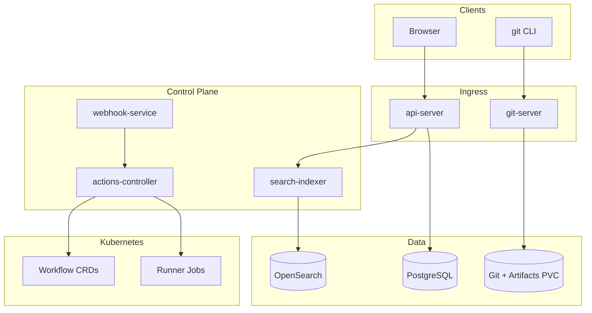

# Architecture

Govnohub is a modular monorepo with separate deployable Go services, a server-rendered web UI, and Kubernetes-native workflow execution.

## Components

## Services

| Service | Role |
|---------|------|
| `api-server` | REST API + templ/HTMX web UI for users, repos, issues, PRs, actions, releases |
| `git-server` | Smart HTTP + SSH git protocol (clone/push) |
| `webhook-service` | Receives push/PR events, enqueues workflow runs |
| `actions-controller` | Polls queued runs, creates K8s Jobs per workflow job |
| `search-indexer` | Indexes repos, issues, PRs into OpenSearch |

## Web UI

The browser UI is served directly from `api-server` via the `internal/web` package:

- **templ** for type-safe HTML components
- **HTMX** for partial page updates (comments, notifications, action logs)
- **Session cookies** for browser auth (JWT/PAT unchanged for API/CLI)
- Static CSS/JS embedded with `go:embed`

## Data Model

PostgreSQL stores all metadata: users, orgs, teams, repos, issues, pull requests, workflows, workflow runs, releases, packages, webhooks, wiki pages, notifications.

Git bare repositories live on PVC at `/data/git`. Workflow logs and release assets use `/data/artifacts`.

## Actions Runtime

1. Push event hits `webhook-service`
2. Matching workflows are loaded from DB
3. `workflow_runs` row created with status `queued`
4. `actions-controller` reconciles runs, parses YAML, creates K8s Jobs
5. Job logs written to artifact PVC; status updated in DB
6. UI reads run status and logs via API

## Kubernetes Resources

- Helm chart: `deploy/helm/govnohub/`
- CRDs: `Workflow`, `WorkflowRun`, `RunnerPool` in `deploy/crds/`
- Runner namespace: `govnohub-runners` with RBAC for Job creation
